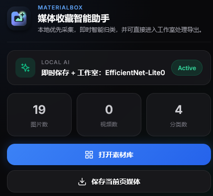
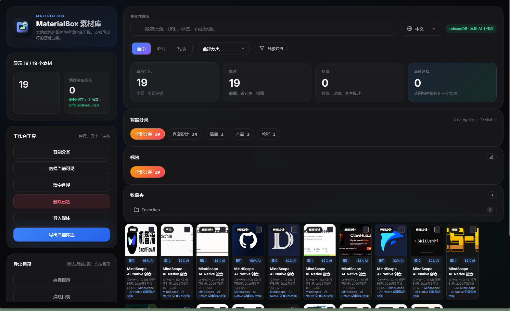
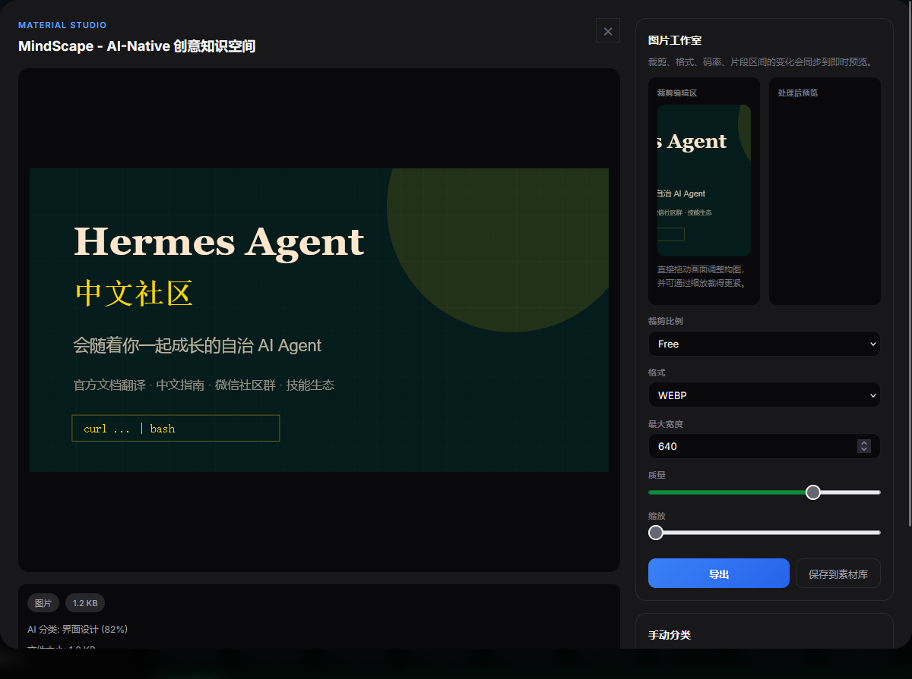
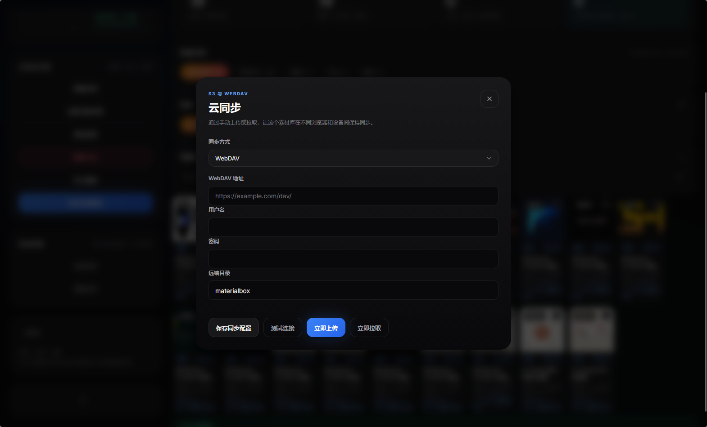
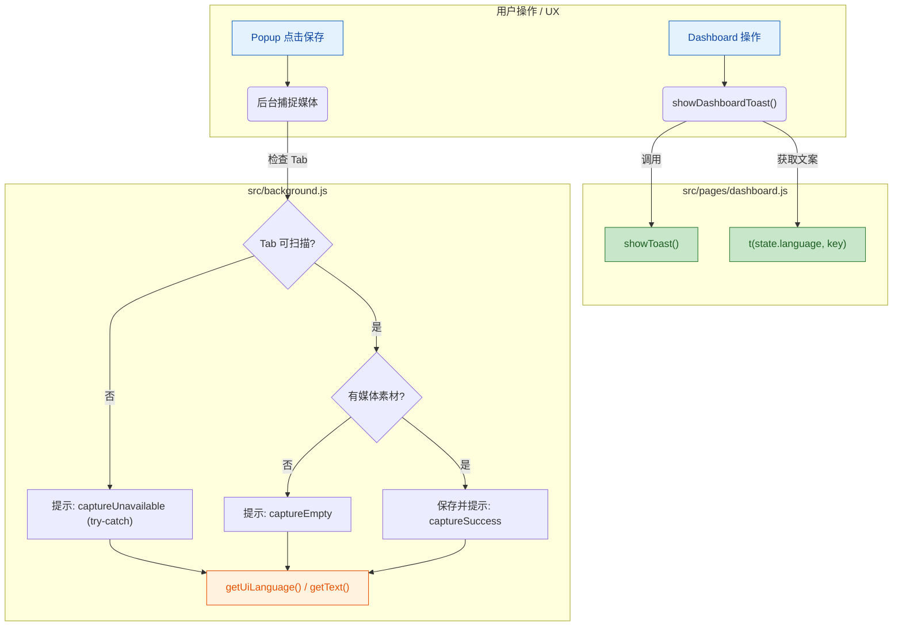

# MaterialBox

一个本地优先的浏览器素材管理扩展，支持 Chrome 和 Firefox。它可以从网页中采集图片与视频，保存在本地 IndexedDB 中，并结合本地模型做基础智能分类。

## 功能演示

### 动态演示

将演示动图放在项目根目录并命名为 `demo.gif` 后，README 会直接展示实际使用流程。


### 界面截图

以下截图展示 MaterialBox Dashboard 的核心功能：

#### 1. 素材库总览 (Dashboard)



**功能说明：**
- **Hero Cards**：顶部四张数据卡片实时显示当前可见素材数量、图片/视频分类统计、已选择项目数
- **搜索与筛选**：支持按关键词搜索、媒体类型（全部/图片/视频）切换、分类下拉筛选
- **高级筛选**：可按日期范围、来源域名、图片尺寸等条件精确过滤
- **AI 智能分类**：显示本地模型的规则数量和当前 AI 服务状态

#### 2. 分类与标签管理



**功能说明：**
- **分类筛选 Chips**：以标签云形式展示各分类下的素材数量，点击快速筛选
- **标签系统**：为素材打标签，支持自定义标签颜色，便于多维度组织
- **智能分类 (Smart Collections)**：根据规则（分类/类型/来源域名）自动聚合素材

#### 3. 素材预览与工作室 (Material Studio)



**功能说明：**
- **图片工作室**：裁剪预设（1:1/4:5/16:9/Free）、格式转换（WEBP/JPEG/PNG）、质量压缩、缩放调整
- **视频工作室**：时间范围截取、码率选择（1.5/3/6 Mbps）、实时预览裁剪效果
- **分类纠正**：点击 AI 分类标签可手动更正，快速优化本地模型
- **导出/保存变体**：可导出处理后的文件或保存为新素材

#### 4. 云端同步设置



**功能说明：**
- **S3 兼容存储**：支持 AWS S3、MinIO、COS 等 S3 兼容对象存储
- **WebDAV 支持**：兼容 NextCloud、ownCloud 等标准 WebDAV 服务器
- **双向同步**：一键上传本地素材至云端，或从云端下载同步素材库

## 功能概览

- 右键快速保存网页图片和视频
- 扫描当前页面并批量收集媒体资源
- 使用 IndexedDB 本地存储素材，不依赖云端服务
- 基于 TensorFlow.js 和本地模型进行图片分类
- 支持手动纠正分类结果，逐步优化本地分类效果
- 提供素材网格浏览、预览、搜索和分类筛选
- 支持素材导入与导出
- 提供中英文界面
- 支持浏览器通知和保存反馈

## 项目结构




- `manifest.json`: Chrome 可直接加载的扩展清单
- `manifest.firefox.json`: Firefox 构建产物使用的扩展清单模板
- `src/background.js`: 后台逻辑、右键菜单、抓取、导出、训练入口
- `src/content-script.js`: 页面媒体扫描与提取
- `src/lib/`: 数据存储、分类器、i18n 和通用工具
- `src/pages/`: popup 与素材库页面
- `_locales/`: 多语言文案
- `scripts/build-browser-packages.mjs`: 浏览器打包脚本

## 环境要求

- Node.js 18+
- npm 9+

## 安装依赖

```bash
npm install
```

## 开发命令

```bash
npm run build
```

脚本说明：

- `npm run build`: 构建 AI bundle、导出 bundle，并生成 `dist/chrome` 与 `dist/firefox`

说明：

- `src/generated/` 中的 bundle 由构建命令生成
- `dist/` 为浏览器打包产物，不建议直接提交

## 本地加载扩展

### Chrome

1. 打开 `chrome://extensions/`
2. 开启开发者模式
3. 选择“加载已解压的扩展程序”
4. 选择项目根目录，或构建后选择 `dist/chrome`

### Firefox

1. 打开 `about:debugging#/runtime/this-firefox`
2. 选择“临时载入附加组件”
3. 选择项目根目录中的 `manifest.json`，或构建后使用 `dist/firefox/manifest.json`

说明：项目根目录默认以 Chrome 加载为主；Firefox 请使用构建后的 `dist/firefox/manifest.json`。

## 开发建议

- 修改 `src/lib/ai-entry.js` 或 `src/lib/export-entry.js` 后，重新执行 `npm run build`
- 提交代码时保留源码与必要资源文件，不提交 `node_modules`、`dist` 等生成产物

## 后续方向

- 引入更强的本地视觉 embedding 或相似度检索能力
- 增加标签系统、批量操作和重复素材检测
- 完善 ZIP 导出与元数据备份
- 增加站点规则、收藏夹和时间线视图
